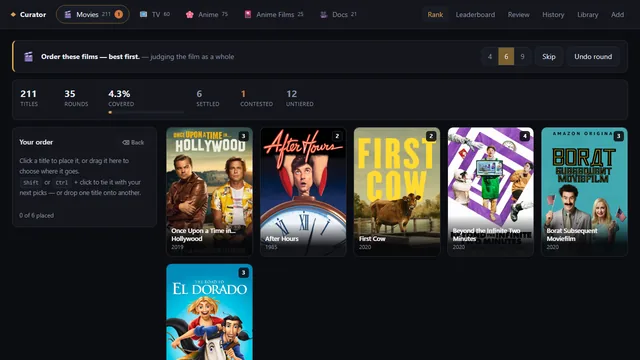

# Curator



Curator ranks everything I've watched. Films, TV, anime, and documentaries each run in
their own contest, and the only question it ever asks is: order these six, ties
allowed.

Live: https://curator.yaqzan.dev

## Why six at a time

Star ratings drift. I'd give three films an 8 a year apart and have no real memory of
which one I actually preferred, and recalibrating a 1-10 scale in my head is harder than
just answering which of six I liked better. So Curator never asks for a number. It shows
six titles, I put them in order, ties are fine, and a score comes out the other end.

The reason it's six and not two is Fisher information. A single head-to-head duel at
equal scores carries 0.50 bits of information about the underlying ranking; ordering six
items at once carries 3.55, a 7.1x gain. Worked through to rounds needed for the same
confidence, that's roughly 110 rounds of ordering six versus about 700 pairwise duels to
reach the same accuracy. The comparisons themselves aren't scored as C(n,2) independent
duels either, since doing that inflates a single judgement 1.5x to 2.7x depending on how
many titles were in the round and quietly breaks the uncertainty estimate the whole
calibration gate depends on. A round is stored and scored as one ranking, decomposed
with a Plackett-Luce likelihood.

Every rating comes out of a batch Bradley-Terry / Plackett-Luce fit run over the entire
comparison history, refit after every round rather than nudged with online Elo. That
gives order-independence and a real posterior standard deviation per title, which is
what decides whether a title needs more rounds before its tier is trustworthy. The
scorer is a straight port of a face-ranking system I'd already built and validated for a
much larger personal project, carried over rather than re-derived.

## Reading Plex's own ledger

Watch history comes from Plex's SQLite database directly, not its HTTP API. The ledger
table is keyed by a global GUID that survives a library being deleted or moved, where
the API's answer depends on the library still existing. That distinction wasn't
theoretical: after a full migration to this machine, Plex reported zero library sections
for a while, and all 107 watch rows in the ledger were still intact and importable.
Tiers, separately, come from a media log I keep in Obsidian, since Plex never had my
actual ratings to begin with. Importing from either source fills in blanks but never
overwrites a tier I set by hand, the same human-edits-win rule I use in a much larger
cataloguing pipeline elsewhere. Radarr and Sonarr, when they're running, add an "on
disk" badge to a card; when they're not, nothing else about the app changes.

`.claude/` holds the guidance I give Claude Code when it works in this repo. I develop
with agents heavily, and the docs there are the project's memory.

## Running it

This is a personal self-hosted tool tied to my Plex library, my Obsidian vault, and my
Windows task scheduler. Here's what you'd need to run it yourself:

```powershell
pip install -r requirements.txt
npm --prefix frontend install && npm --prefix frontend run build

python -m curator import-plex     # pull the watched corpus
python -m curator serve           # http://127.0.0.1:5002
pytest                            # 63 tests, no database or network needed
```

A Plex token is read from `CURATOR_PLEX_TOKEN` or, on Windows, the registry key Plex
itself populates. Radarr and Sonarr integration is optional and fails soft if either
isn't running.

## Layout

```
curator/
  media_types.py    the contest registry, the only place a type key is written
  scorer.py         the batch Bradley-Terry / Plackett-Luce fit
  ranking.py        history, refit, undo, purge, the audit pool
  catalog.py        adding titles; imports never overwrite a hand-set judgement
  sources/          Plex watch ledger, Plex metadata + search, Radarr/Sonarr badge
frontend/           Vite + React + TypeScript
ops/                cloudflared tunnel config
tests/               63 tests; no database or network needed
```

## Status

Live and in daily use for my own watch tracking. This is a snapshot of a private working
repo; the commit history isn't published.

## License

MIT
